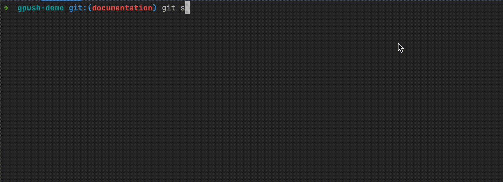

# gpush

`gpush` is a command line utility for standardising commit messages using [Conventional Commits](https://www.conventionalcommits.org/en/v1.0.0/).

# Installation

This package is available for installation via pypi

```
pip3 install gpush
```

# Usage

When running gpush in a git directory, use `gpush` to replace your standard `git commit && git push` commands. `gpush` will ask three questions to determine detail about your commit and generate a conventionally formatted git commit message.



# Local development

To develop locally, execute the pip3 installation in the local directory:

```
pip3 install .
```

Alternatively, create an alias in your zshrc file (Use appropriate profile file if you do not use zsh)

echo "alias gpush=\"python3 /path/to/git/gpush/gpush\"" >> ~/.zshrc
To start using straight away, source your file

source ~/.zshrc

# Unit tests

To run unit tests, execute the following command, you will need to have pytest installed and set environment
variable `GITHUB_TOKEN` to a valid GitHub token that has permissions to create/delete and push to a repository
within your account.

```
make test
```

The unit tests will create a test repository within your account for each unit test before testing functionality and deleting the repository.

# python-semantic-release

`gpush` generates commit messages that are compliant with [python-semantic-release](https://python-semantic-release.readthedocs.io/en/latest/). See example in the [GitHub Repository](https://github.com/tjtharrison/gpush/blob/main/.github/workflows/semver.yaml)
